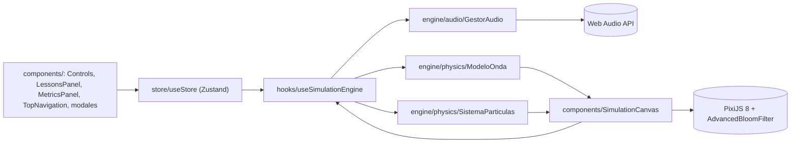

<div align="center">
  
  <h1>SonoWave</h1>
  <p><b>Laboratorio web para visualizar y escuchar la propagación de una onda sonora: PixiJS para el dibujo, Web Audio para el tono y una física simplificada.</b></p>
  
  
  
  
  
  
  <a href="https://github.com/Luiss2080/SonoWave/actions/workflows/ci.yml"></a>
  <p>
    <a href="#-inicio-rápido">Inicio rápido</a> ·
    <a href="#-características">Características</a> ·
    <a href="#-arquitectura">Arquitectura</a> ·
    <a href="#-pruebas">Pruebas</a> ·
    <a href="#-lo-que-todavía-no-existe">Limitaciones</a>
  </p>
</div>

**SonoWave** (antes "Simulador de Ondas Pro") es un simulador didáctico en React que dibuja frentes de onda circulares desde una fuente, con una malla de partículas que se desplaza al paso de la onda, y genera un tono con un `OscillatorNode` de Web Audio. El motor físico está escrito con clases TypeScript propias. **Estado real:** funciona con PixiJS 8.20.1 (verificado en Chrome headless: monta el canvas WebGL y la interfaz sin errores de consola); el renderizado real sigue sin pruebas automáticas. Detalles en [Lo que todavía no existe](#-lo-que-todavía-no-existe).

## 🎬 Vista rápida

No hay capturas: la aplicación no llega a renderizar en la versión actual del repositorio (ver más abajo), y este README no muestra imágenes que no se puedan reproducir. Flujo que el código está diseñado para ofrecer:

```text
Ayuda inicial ──▶ Panel "Controles Pro" (derecha)          Panel "Misiones" (izquierda, estático)
                   · Emisión: continuo / pulso                     │
                   · Onda: senoidal / cuadrada / triangular        ▼
                   · Frecuencia 1-5 Hz · Amplitud 0-100     Canvas 800×400 (PixiJS)
                   · Medio: aire / agua / acero               · anillos de presión desde la fuente
                   · Vista: ondas / partículas / ambos        · partículas desplazadas por la onda
                   · Color: cian / magenta / verde            · clic = pulso extra en ese punto
                   · Audio on/off · Reiniciar · Ajustes       HUD: FPS medidos con requestAnimationFrame
```

## ✨ Características

Lo que está implementado en el código (independientemente de que hoy el canvas no monte):

| Característica | Detalle |
| :--- | :--- |
| 🌊 Modelo de onda | `ModeloOnda` guarda el historial de emisiones y calcula la presión a una distancia con retardo `distancia / velocidad` y atenuación `factor^(distancia/50)`. Modo continuo (seno) o pulso con envolvente gaussiana. |
| 🧪 Medios | Aire, agua y acero cambian la velocidad de propagación en la simulación (200, 600 y 1200 px/s). **No** son las velocidades reales del sonido. |
| 🔵 Partículas | Malla de unas 1 450 partículas (paso de 15 px) desplazadas según el modelo, en `SistemaParticulas`. |
| 🎧 Audio | `GestorAudio` usa un `OscillatorNode` con senoidal/cuadrada/triangular; el tono es `frecuencia × 100` Hz y el volumen sigue la amplitud. Falla sin excepción si Web Audio no está disponible. |
| 🖱️ Interacción | Clic en el canvas crea un pulso extra; reinicio de parámetros; ventana de ajustes con modo interferencia (segundo emisor simplificado) y factor de amortiguación; el HUD se puede ocultar. |
| 📸 Snapshot | El botón "Guardar Snapshot" descarga el primer `<canvas>` de la página como PNG. |
| 🗂️ Estado | Store global con Zustand (`useStore`) que conecta los paneles con el motor. |

## 🏗️ Arquitectura

La interfaz (React + Tailwind + Framer Motion) lee y escribe en un store de Zustand; el hook `useSimulationEngine` sincroniza el store con las clases del motor y `SimulationCanvas` dibuja con PixiJS en cada tick.



<details>
<summary>Estructura de carpetas</summary>

```text
src/
  components/   paneles, modales y SimulationCanvas
  engine/       physics/ (ModeloOnda, SistemaParticulas) y audio/ (GestorAudio) con sus tests
  hooks/        useSimulationEngine
  store/        useStore (+ test)
  assets/       estilos globales
  core/ physics/ render/ ui/ audio/ principal.js   versión anterior en JavaScript (no se carga; ver Limitaciones)
docs/           22 documentos por fases y MANUAL_DE_USO.md (diseño original; no verificado contra el código)
.github/workflows/ci.yml   tests + build con Node 20
```

</details>

## 🚀 Inicio rápido

| Requisito | Detalle |
| :--- | :--- |
| Node.js y npm | Node 20 en la CI; verificado también con Node 24 |
| Navegador | Con WebGL y Web Audio |

```bash
git clone https://github.com/Luiss2080/SonoWave.git
cd SonoWave
npm ci
npm run dev       # Vite; abre la URL que imprime (normalmente http://localhost:5173)
npm test          # Vitest, una pasada
npm run build     # tsc + vite build
```

`index.html` carga la fuente *Outfit* desde Google Fonts y Font Awesome desde un CDN, así que sin internet se ve con fuentes por defecto.

## 🧪 Pruebas

```bash
npm test
```

- **23 pruebas en 6 archivos**, todas pasan (Vitest 5 + jsdom + Testing Library): `ModeloOnda`, `SistemaParticulas`, `GestorAudio`, `useStore`, `Controls` y `App`.
- Cubren el motor y el estado; **no** cubren el renderizado real con PixiJS (jsdom no tiene canvas, por lo que hay avisos de `getContext()` no implementado). Por eso un fallo de arranque del canvas (como el corregido en PixiJS 8) no lo detectarían; se verificó a mano en Chrome headless.
- `npm run build` (`tsc` + `vite build`) compila sin errores; la CI instala, prueba y compila.

## 🚧 Lo que todavía no existe

- **El README anterior prometía cosas que el código no hace:** velocidades reales del sonido (343, 1480 y 5000 m/s; el código usa 200, 600 y 1200 px/s), efecto Doppler (la lección aparece bloqueada y `sourceVelocity` no se usa en la física), interferencia con dos fuentes reales y un sistema de misiones con progreso.
- **Pausa y cámara lenta:** el store y el canvas los soportan (`isPaused`, `timeScale`), pero ningún control de la interfaz los activa.
- **Misiones:** el panel muestra 4 tarjetas estáticas; una aparece "completada" por dato fijo y dos están bloqueadas. No hay lógica de progreso.
- **Interferencia:** el modo "dos emisores" promedia un segundo retardo sobre una onda radial; no es una superposición 2D real.
- Existe un código anterior en JavaScript (`src/core`, `src/physics`, `src/render`, `src/ui`, `src/audio`, `src/principal.js`) que `index.html` no carga y que duplica el motor actual.
- Los documentos de `docs/` describen el diseño por fases y pueden diferir de la implementación.
- El historial de Git pesa unos 50 MB.

## 📄 Licencia

Sin licencia definida: todos los derechos reservados por defecto.

<div align="center">
  <sub>Hecho por Luiss2080 · Simulador didáctico de ondas sonoras</sub>
</div>
